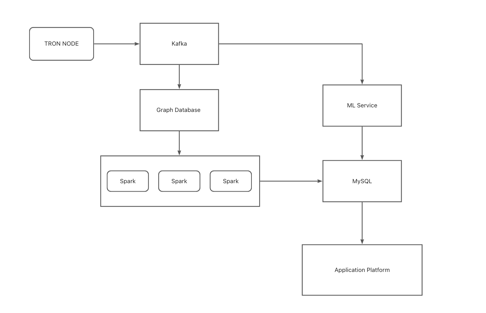

# Automatic TRON Address Clustering

## Introduction

In this age of information boom, the SlowMist security team discovered that malicious actors frequently utilize social media, phishing websites, and other methods to steal users' digital assets. Our address identification mechanism primarily uses graph and machine learning algorithms to evaluate the public transaction history of TRON's users and label their addresses into 3 separate categories: Hot wallet, Cold wallet, and Common users. This is accomplished by combining the graph algorithm with node mining techniques to execute large-scale mining of transaction attributes of user address transactions. This also has the ability to perform influence analysis, community discovery based on tag propagation algorithm, and transaction path discovery based on graph traversal algorithm.

## Architecture

## Deployment Environment

### Node Server 
- Only One
- CPU：16 cores
- RAM：32G
- SSD：1.5T+
- Bandwidth：100M
- Docker Server：20.10.5
- Deploy the TRON Node and Kafka

### Algorithm Server 
- At Least One
- CPU：16 cores
- RAM：32G
- SSD：500G+
- Bandwidth：100M
- Docker Server：20.10.5
- Deploy Spark 

### Platform Server
- At Least One
- CPU：16 cores
- RAM：32G
- SSD：500G+
- Bandwidth：100M
- Docker Server： 20.10.5
- Deploy graph database:  Nebula Graph

### Install dependency component

 [Install Reference](doc/install.md)

## Core Code and Usage

### Machine Learning

The machine learning component primarily employs the ensemble learning model, with label data derived from publicly available information on the TRON  explorer, mixed with manual data analysis to organize and train the model.

[More Detail](doc/code.md#machine-learning)

### Graph Algorithms

We generate the point and edge data from the data set and import it into the graph database for use in the next graph query and graph algorithm calculation.
    

[More Detail](doc/code.md#graph-algorithms)

## Summarize

Our goal this time is to present an advanced system utilizing machine learning and graph computing to analyze attributes of TRON addresses to identify common user addresses, hot wallet addresses, and cold wallet addresses in the TRON ecosystem. At the same time, our analysis will examine each address's characteristics and relationships to aid in the tracking of hacker addresses and activity, allowing relevant personnel to access additional insight into a wallet. 

## Future

1. Improve the algorithm to enhance recognition accuracy
2. Access additional TRON ecosystem functionality, expand data scope, and enhance processing efficacy.
3. Increase application scope and generate value for more users.
4. To better serve the TRON community and its users, we will continuously enhance MistTrack's user experience and capabilities. Additional servers will be added to increase performance and introduce new algorithms to assist the needs of various users. Such as implementing the Graph Neural Networks algorithm (using the DGL component) for community research in the near future. With each new update, MistTrack will be able to provide additional benefits to our users. 

## Links

1. [Our submission on TRON Grand Hackathon Season 3](https://devpost.com/software/automatic-tron-address-clustering)

2. [Our submission on TRON Grand Hackathon 2022](https://devpost.com/software/misttrack-analytics-platform)

3. [MistTrack Platform Intro](https://misttrack.io/)

4. [MistTrack Dashboard](https://dashboard.misttrack.io/)
