## Machine Learning
The machine learning component primarily employs the ensemble learning model, with label data derived from publicly available information on the TRON explorer, mixed with manual data analysis to organize and train the model.


1. [get_address_from_kafka.py](../code/ml/1_get_address_from_kafka.py)

    Pull the existing address from Kafka and save the transaction data on the chain as a CSV file.

2. [get_address_tag.py](../code/ml/2_get_address_tag.py)  

    Retrieve all address labels from the TRON explorer as training data labels.

3. [create_feature.py](../code/ml/3_create_feature.py)  

    Historical transaction record files can be used to produce address features. Features can be customized with the following attributes and are defined as: the number of transfers in, the number of transfers out, the number of addresses transferred out, the number of addresses transferred in, the average amount transferred out, the average amount transferred in, the average transaction interval (minutes), and finally, the monetary value.

4. [train_model.py](../code/ml/4_train_model.py)  

    Utilizes the amended XGBoost multi-classification method to train the model and generate a model file.

5. [deploy_model.py](../code/ml/5_deploy_model.py) 

    Deploys real-time data prediction scripts, retrieves the data stream from Kafka, outputs the results of model prediction, and saves the prediction results in the MySQL database for easy interface query.

## Graph Algorithms

[create_graph_data.py](../code/graph/create_graph_data.py)

   We generate the point and edge data from the data set and import it into the graph database for use in the next graph query and graph algorithm calculation.
    
Relationship

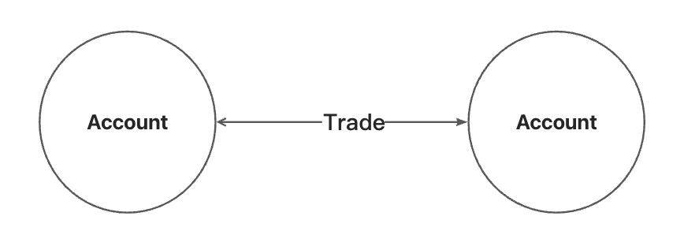

The point properties are as follows

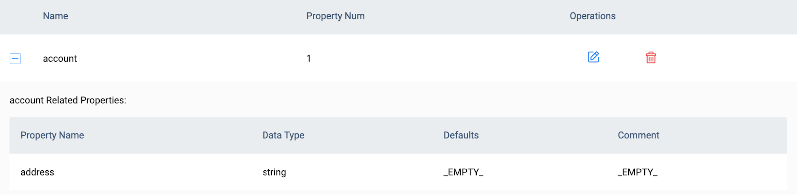

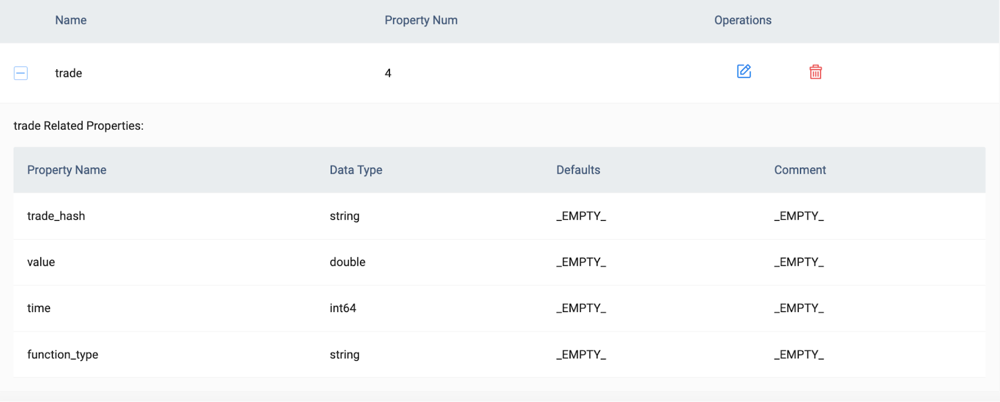

Scala is used to create graph algorithms, while data is obtained from the graph databases and submitted to spark for execution. The results are saved in a local file, and the packaged file name is [graph-algorithm.jar](https://drive.google.com/file/d/11QYj-YUpS8JfZs-oy7jhIwBIZoB_apTK/view?usp=sharing).

1. Use the [PageRank algorithm](https://en.wikipedia.org/wiki/PageRank) to find key points and set parameters in application.conf 
```
pagerank: {
    maxIter: 15
    resetProb: 0.15 
}
```
Then run the command:

```
./bin/spark-submit --master "local" \
--driver-class-path guava-14.0.jar \
--driver-library-path guava-14.0.jar \
--conf spark.executor.extraClassPath=guava-14.0.jar \
--conf spark.executor.extraLibraryPath=guava-14.0.jar \
--class com.vesoft.nebula.algorithm.Main nebula-algorithm-3.0.0.jar \
-p application.conf
```
The monitor page is:

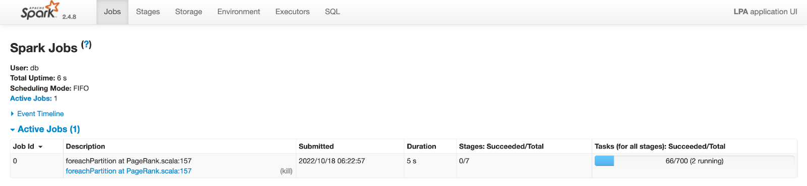

Result Sample
```
_id,pagerank
415345,0.8998022228203086
156345,0.6670256668280699
225845,1.4217364169494018
19045,0.4029707289214662
360945,0.8998022228203086
112845,0.46994271648008634
57445,0.6370717481740534
476445,1.0117911621242344
386745,0.4052896257288459
…
```
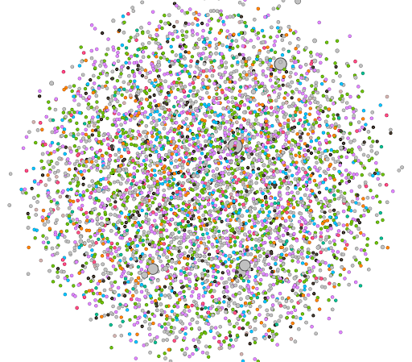

The importance of representing nodes with distinct addresses is represented by the left value of PageRank.

2. Community Discovery Using the [KCore Algorithm](https://en.wikipedia.org/wiki/Degeneracy_(graph_theory)#k-Cores)

Modify the configuration and repeat the above steps

```
kcore:{
    maxIter:10
    degree:1
}
```

Result Sample

```
_id,kcore
7942,1
235942,1
123642,2
99942,1
333242,4
378942,1
219242,2
323442,4
236442,1
...
```

Represents the centrality of different nodes

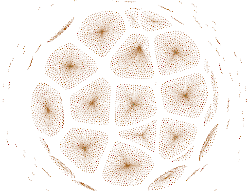

3. Using the [Label Propagation](https://en.wikipedia.org/wiki/Label_propagation_algorithm) method to discover unknown labels by comparing them to known labels.

Modify the configuration and repeat the above steps

```
labelpropagation: {
    maxIter: 20
}
```
Result Sample
```
_id,lpa
86492,439341
463192,129283
381792,57970
194592,439313
167692,236620
385492,405349
56892,402012
262492,210571
58592,402012
...
```
Represents node label propagation features

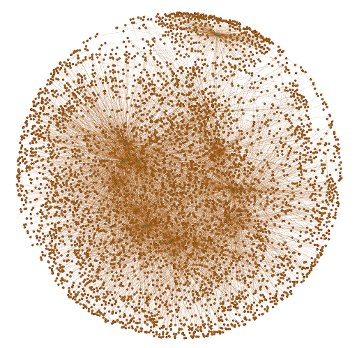
## Result analysis

1. use machine learning 

The result is:

```
hot
THQ5HzNiA93B8gSikG53c5RQ3fj4WnbGzj
hot
TBvT5fifnK3FJMhhtPdXgiGuj7VV2Pwyf7
hot
TUuDtfz4pbie2LReycMy2FJGcQdVTr2h7v
hot
TS9b9boewmB6tq874PnVZrKPf4NZw9qHPi
hot
TFrRVZFoHty7scd2a1q6BDxPU5fyqiB4iR
hot
TMpNNYmNjP1EdeEWYogdEGYjiiuBcT1Dkf
…

```

As we see, a wallet is rare, but we got some hot wallets.

Even though cold wallets are pretty rare, we have plenty of hot wallets available.

For example, [TBvT5fifnK3FJMhhtPdXgiGuj7VV2Pwyf7](https://tronscan.org/#/address/TBvT5fifnK3FJMhhtPdXgiGuj7VV2Pwyf7/transfers) has 304,001 TRC20 and TRC721 transactions. Given that the input and output are related to exchanges such as Huobi, OKEx, etc., we can conclude that the results are accurate to a large extent.

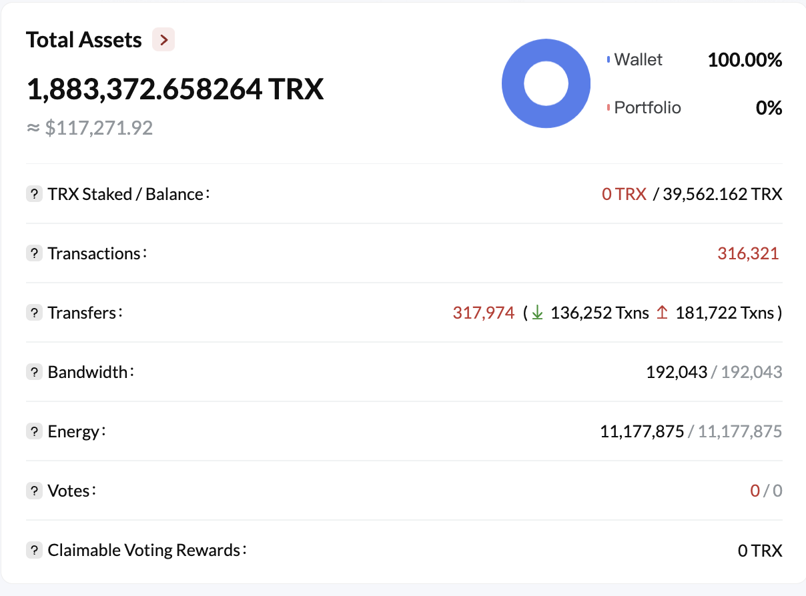

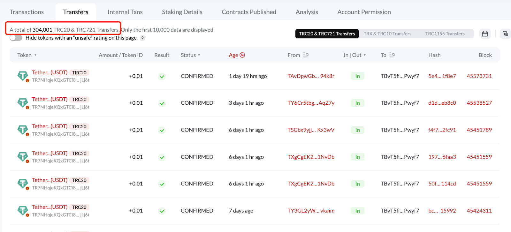

2. use graph algorithms

With PageRank we got some addresses and their’ importance value.

```
 _id pagerank
6235  102.871703
386496  178.802019
97186  183.492653
37884  686.464775
146694  82.208568
51975  102.310699
356633  31.042988
191620  6260.11569
296695  117.813992
…
```

For example, the id 386496 is [THAABzWrhp84Nr7gxss7qhtzA5mp3d1qUo](https://tronscan.org/#/address/THAABzWrhp84Nr7gxss7qhtzA5mp3d1qUo/transfers)

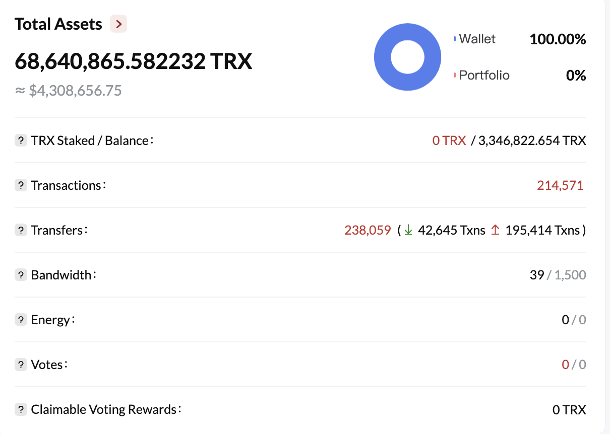

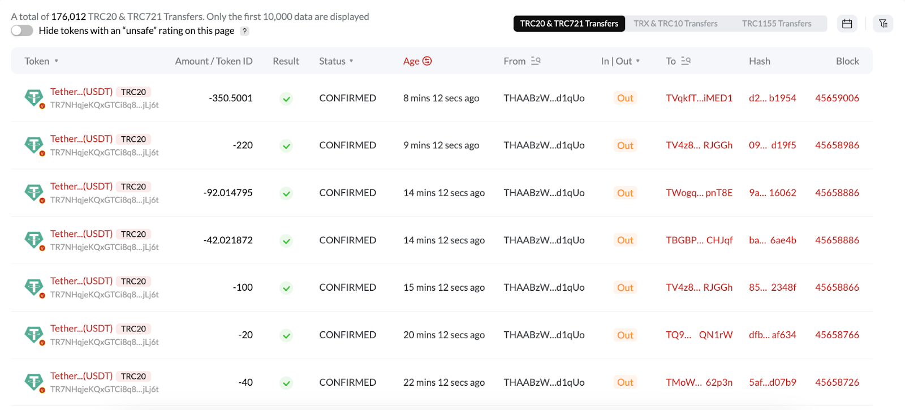

This address has 176,012  TRC20 & TRC721 transactions. And the input addresses and output addresses belong to some exchange platforms such as KuCoin, Binance, etc. So we think this result is correct.

3. conjoint analysis

The machine learning and graph algorithms are a pipeline for detecting target addresses. If you want to search for hot wallet addresses, machine learning and PageRank can be fine, if you want to search for some bad groups, you can use machine learning and Label Propagation technology.


## Attached

Some common query statements for Graph Databases:

1. >MATCH (n:account) where id(n)==81132 return n;

2. >FIND SHORTEST PATH FROM 272334 TO 227788 OVER * YIELD path AS p;

3. >GET SUBGRAPH 2 STEPS FROM 272334 YIELD VERTICES AS nodes, EDGES AS relationships;

[Click Here for more](https://docs.nebula-graph.io/3.3.0/3.ngql-guide/1.nGQL-overview/1.overview/)
