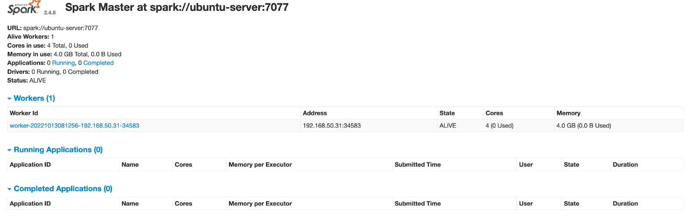

## Node Server

[TRON Node and Kafka deployment](https://developers.tron.network/docs/deploy-the-fullnode-or-supernode)


key configuration as the following

```
topics = [
        {
          triggerName = "block" // block trigger, the value can't be modified
          enable = false
          topic = "block" // plugin topic, the value could be modified
        },
        {
          triggerName = "transaction"
          enable = true
          topic = "transaction"
        },
        {
          triggerName = "contractevent"
          enable = false
          topic = "contractevent"
        },
        {
          triggerName = "contractlog"
          enable = false
          topic = "contractlog"
        },
        {
          triggerName = "solidity" // solidity block event trigger, the value can't be modified
          enable = true            // the default value is true
          topic = "solidity"
        },
        {
          triggerName = "solidityevent"
          enable = true
          topic = "solidityevent"
        },
        {
          triggerName = "soliditylog"
          enable = true
          topic = "soliditylog"
        }
    ]

    filter = {
       fromblock = "earliest" // the value could be "", "earliest" or a specified block number as the beginning of the queried range
       toblock = "latest" // the value could be "", "latest" or a specified block number as end of the queried range
       contractAddress = [
           "TR7NHqjeKQxGTCi8q8ZY4pL8otSzgjLj6t", // contract address you want to subscribe, if it's set to "", you will receive contract logs/events with any contract address.
           "TEkxiTehnzSmSe2XqrBj4w32RUN966rdz8"
       ]

       contractTopic = [
           "ddf252ad1be2c89b69c2b068fc378daa952ba7f163c4a11628f55a4df523b3ef" // contract topic you want to subscribe, if it's set to "", you will receive contract logs/events with any contract topic.
       ]
    }
}

```

## Algorithm Server

a. Deploy Spark

Reference: https://spark.apache.org/docs/2.4.4/

Must:

- Scala 2.11 
- JDK 8  
- Hadoop 2.7 
- Spark 2.4.x 
- Python 3.7




b. Deploy Redis

> docker run -itd --name redis-test -p 6379:6379 redis

c. Deploy MySQL

> docker run -itd --name mysql -p 3306:3306 -e  MYSQL_ROOT_PASSWORD=[my_password] mysql

create table: info

|  name   | type  |
|  ----  | ----  |
| id  | int |
| address  | varchar(255) |
| tag  | varchar(64) |

## Platform Server

[Use Docker Compose deploy graph database](https://docs.nebula-graph.io/3.2.1/4.deployment-and-installation/2.compile-and-install-nebula-graph/3.deploy-nebula-graph-with-docker-compose/)
